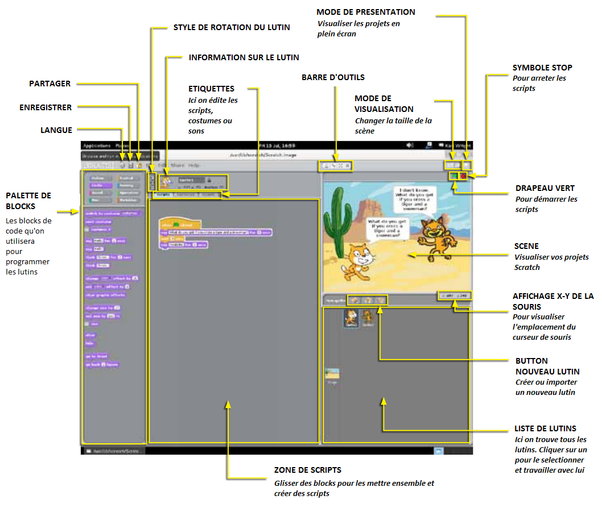
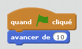
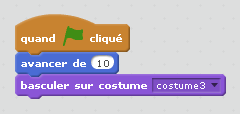
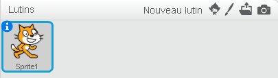

# Commencer avec Scratch

Scratch est un outil de programmation visuelle qui permet à l'utilisateur de créer des animations et des jeux dans une interface glisser-déposer. Cela nous permet de créer nos propres jeux vidéo, des histoires intéractives et des animations en utilisant des techniques de programmation sans avoir pour autant à écrire des lignes de code. C'est une excellente façon pour initier les jeunes à la programmation avec un Raspberry Pi.

## Introduction

Vous trouverez Scratch dans le bureau de Raspbien ou Ubuntu Mate et ensuite dans **Education** du menu d'applications.  Quand vous l'ouvrez vous verrez une fenêtre comme celle-ci: 

## Faites bouger le chat de Scratch

Le chat qui se trouve dans la fenêtre blanche est un exemple des **lutins** dans Scratch. Actuellemnt sprite le chat de Scratch est dans une **scène** vierge.  Faisons bouger le chat.

1. Cliquez sur sprite le chat de Scratch.
2. Ensuite cliquez sur la palette de blocs et selectionnez **Evènements**.
3. Glissez le bloc **Quand le drapeau vert est cliqué** et mettez-le dans la zone de script au milieu de l'écran.
4. Ajoutez un bloc bleu **Avancer de 10** de la palette de blocs **Mouvement** et connectez-le au bloc **Quand le drapeau vert est cliqué** .
5. Maintenant cliquez l'image du drapeau vert qui se trouve en haut à droit de l'écran et regardez le chat bouger!
6. Pouvez-vous faire bouger le chat encore plus loin? 

## Changer l'apparence du lutin

Tous les lutins dans Scratch peuvent porter des costumes différents.

1. Cliquez sur le lutin pour le selectionner. Cliquez sur l'étiquette **Costumes** qui se trouve au milieu de l'écran.
2. Vous verrez que le chat a deux costumes. Cliquez sur **Dupliquer** pour créer un troisième costume. Un nouveau costume de chat doit apparaître.
3. Selectionnez **costume3** pour l'éditer. Amusez-vous à tester tous les boutons et outils pour découvrir leurs usages.
4. Ensuite, dessiner quelques vêtements dans le costume et cliquez sur **OK**.
5. Pour alterner entre les costumes, cliquez sur l'étiquette **Scripts**. Ajoutez le bloc violet **Apparence** , **Basculer sur costume**, glissez-le vers les autres blocs et connectez-le.
6. Selectionnez **costume3** dans le menu déroulant qui se trouve dans le bloc violet.
7. Maintenant lancer le programme pour observer le changement du costume.

## Ajouter des lutins

Si le chat de Scratch ne vous convient pas, vous pouvez ajouter d'autres lutins ou même en créer vos propres!

1. Au dessus de la palette des lutins il y a trois icônes pour créer des nouveaux lutins.
2. Le premier vous permet de **Dessiner un nouveau lutin**. Cliquez sur cela et la fenêtre d' **Editeur de la peinture** s'ouvrira. Ici vous pouvez utiliser des formes, lignes et dessins libres pour créer vos lutins.
3. Le second icône vous permet de **Choisir un nouveau lutin** de ceux qui existent déjà dans Scratch ou qui ont été enregistrés dans votre Raspberry Pi. Cliquez sur cela et vous serez capables de naviguer dans les fichiers qui contiennent ces lutins et ensuite selectionner celui que vous souhaitez.
4. Le troisième icône , quand cliqué, vous donnera un **lutin surprise**.  Cliquez-le et vous verrez ce qui se passera!

## Pour aller plus loin
Maintenant que vous connaissez les bases de Scratch, pourquoi ne pas essayer de compléter la ressource  [Robot Antenna](http://www.raspberrypi.org/learning/robot-antenna/) pour faire clignoter une LED.
